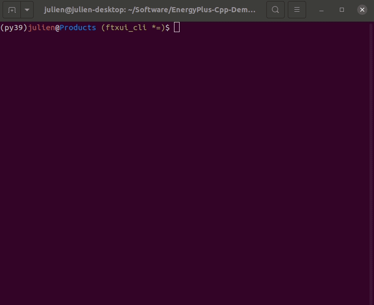

# C++ to drive EnergyPlus



## Usage

This uses my branch: https://github.com/NREL/EnergyPlus/tree/export_energyplusapi


Make sure you have conan installed: `pip install conan` (tested with 1.53)

```shell
conan install . -pr:b=default -b missing -if build/ -of build
cd build/
cmake -G Ninja -DCMAKE_TOOLCHAIN_FILE=conan_toolchain.cmake -Denergyplus_DIR:PATH=/Users/julien/Software/Others/EnergyPlus-build-release/_CPack_Packages/Darwin/TGZ/EnergyPlus-22.2.0-5b72c372e7-Darwin-macOS12.1-arm64/lib/cmake/energyplus ..
ninja
cd Products/
./test
```
